# vLLM Nsight Systems：Eager 与 CUDA Graph 逐步瓶颈分析

这份文档回答一个具体问题：在固定的 vLLM/Qwen3 decode workload 中，为什么 Eager 路径的 `MODEL_FORWARD` 约 20 ms，而只切换到 `FULL CUDA Graph` 后 Host 侧执行可以降到约 1 ms？

文档的证据链是：

```text
全局 report
  -> steady decode 样本
  -> NVTX coarse phase
  -> CUDA API 与 GPU kernel
  -> Correlation ID
  -> 相邻 kernel gap
  -> 单变量 CUDA Graph intervention
  -> GraphLaunch / GraphExec replay
  -> bottleneck migration
```

## 使用说明

- 图片目录为当前 Markdown 同级的 `14-nsight-eager-cudagraph-images/`，全部使用短 ASCII 相对路径，适合 Typora、VS Code、GitHub 风格 Markdown 阅读器。
- 文中的数字是本次 profile 的观测值，不应直接当作其他模型、batch 或 GPU 的普遍结论。
- `Eager` 与 `cg_full` 只改变 CUDA Graph mode；Compilation、Attention backend、模型和硬件保持不变。

## 实验配置

```yaml
runtime: vLLM 0.26.0
engine: V1 Engine
model_runner: V2 ModelRunner
model: Qwen3-0.6B
gpu: NVIDIA A100 80GB PCIe
parallelism: TP=1, PP=1, DP=1
attention: FlashAttention 2
runner: eager
profiling: Nsight Systems, cuda+nvtx, spawn

variants:
  eager:
    compilation_mode: NONE
    cudagraph_mode: NONE
  cg_full:
    compilation_mode: NONE
    cudagraph_mode: FULL
```

### 采集命令模板

以下命令是 profile 的结构模板。实际运行时应替换模型路径、服务参数和输出目录，并记录 `git status`、commit、GPU、模型 hash 与 workload。

```bash
cd /home/qcrs/learning/llm-kv-lab
source ./activate

NSYS=/usr/local/cuda-12.1/bin/nsys
OUT=04-experiments/qcache/p0/profiles/nsys/qwen3-06b-eager

"$NSYS" profile \
  --trace=cuda,nvtx \
  --capture-range=nvtx \
  --capture-range-end=stop \
  --sample=none \
  --cpuctxsw=none \
  --force-overwrite=true \
  -o "$OUT" \
  ./.venv/bin/python path/to/your_workload.py
```

采集前建议先确认工具版本和当前源码状态：

```bash
./.venv/bin/python -c \
  'import torch, vllm, triton; print(torch.__version__, torch.version.cuda, vllm.__version__, triton.__version__)'
"$NSYS" --version
git -C third_party/vllm rev-parse HEAD
git -C third_party/vllm status --short --branch
```

| **项目**    | **固定条件**                                              |
| --------- | ----------------------------------------------------- |
| Runtime   | vLLM 0.26.0 / V1 Engine / V2 ModelRunner / TP=PP=DP=1 |
| 模型与硬件     | Qwen3-0.6B / NVIDIA A100 80GB PCIe                    |
| Eager     | CompilationMode.NONE + CUDAGraphMode.NONE             |
| cg_full  | CompilationMode.NONE + CUDAGraphMode.FULL             |
| default   | VLLM_COMPILE + FULL_AND_PIECEWISE                  |
| Attention | FlashAttention 2（Eager 与 Graph 对照中保持不变）               |
| Profiling | Nsight Systems 2024.7.1 / cuda,nvtx / spawn           |

<table>
<tbody>
<tr class="odd">
<td><p><strong>这版为什么重写</strong></p>
<p>上一版图选得对，但对“为什么看这张图、这张图解决了哪个问题、下一步为什么这样缩小范围”解释不足，尤其 CUDA Graph 部分默认读者已经知道 capture/replay。本版把 Graph 从零讲起，并把整个性能分析过程写成一条可复用的推理链。</p></td>
</tr>
</tbody>
</table>

# 0. 先学会一种分析姿势：每张图都回答四个问题

看 Nsight 最危险的方式是“看到什么就解释什么”。正确的方法是每打开一张图都先明确它在整个诊断树里的位置。

| **问题**      | **你应该问什么**                |
| ----------- | ------------------------- |
| 为什么看这张图？    | 上一层还剩哪个未回答的问题？            |
| 这张图能直接观察什么？ | 只描述看得见的事件、范围、时间和关联，不先猜根因。 |
| 它说明了什么？     | 在当前证据范围内能排除/支持哪一个假设？      |
| 下一步为什么这么做？  | 选择下一张图是为了区分仍然存在的两个或多个解释。  |

本次完整诊断链：  
  
全局 30s report  
↓ 为什么：不能把初始化、warmup、steady decode 混在一起  
选 steady Call50  
↓  
SCHEDULE / EXEC_SUBMIT / SAMPLE  
↓ 为什么：先找 iteration 的最大项  
MRV2_EXECUTE  
↓  
PREPARE_INPUTS / ATTN_ADDR / ATTN_META / MODEL_FORWARD  
↓ 为什么：继续找最大 coarse phase  
MODEL_FORWARD ≈ 20ms  
↓  
CUDA API + GPU Kernels  
↓ 为什么：判断 20ms 是 Host 慢还是 GPU 慢  
Correlation ID  
↓  
单个 launch ↔ 单个 kernel  
↓ 为什么：把 CPU submission 与 GPU execution 一一对应  
相邻 kernel gap  
↓ 为什么：区分 Host late-submit 与 GPU queue  
形成 Eager host/framework cadence 假设  
↓  
只开启 FULL CUDA Graph  
↓ 为什么：做单变量 intervention 验证根因  
GraphLaunch + GraphExec  
↓  
MRV2 ≈ 21ms → ≈1ms / TPS ≈ 7.9×  
↓  
根因闭环 + Bottleneck Migration

# 1. Nsight 的四层分析架构

这四层要同时存在，才能从“业务函数”走到“真实 GPU 执行”。任何只看其中一层的分析都容易误判。

Layer 1：业务语义  
NVTX  
SCHEDULE / EXEC_SUBMIT / MRV2_EXECUTE / MODEL_FORWARD  
↓  
Layer 2：Host CUDA 提交  
CUDA API  
cudaLaunchKernel / cudaGraphLaunch / cudaMemcpyAsync / Event / Sync  
↓  
Layer 3：Host ↔ Device 关联  
Correlation ID  
↓  
Layer 4：Device execution  
CUDA HW / Stream / Kernel / GraphExec / MemOps

<table>
<tbody>
<tr class="odd">
<td><p><strong>先记一句最重要的话</strong></p>
<p>NVTX 告诉你“这段代码在做什么”；CUDA API 告诉你“CPU 向 CUDA 提交了什么”；Correlation ID 告诉你“这个 Host 事件对应哪个 GPU 事件”；CUDA HW 才告诉你“GPU 实际执行了什么”。</p></td>
</tr>
</tbody>
</table>

<table>
<tbody>
<tr class="odd">
<td><p><strong>看这张图是为了什么</strong></p>
<p>第一次打开 report 时，不是找 bottleneck，而是确认真正执行 CUDA 的进程、EngineCore thread、NVTX、CUDA API 和 CUDA HW 在哪里。</p></td>
</tr>
</tbody>
</table>

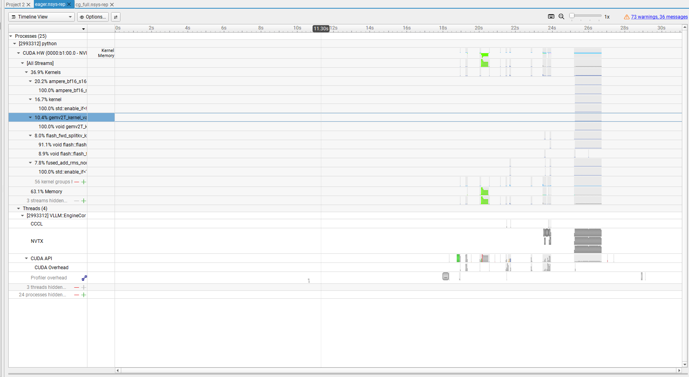

**图 1 Eager report 全局地图**

**从图中直接看到：**PID 2993312 的 python process 下既有 EngineCore thread，也挂着 CUDA HW；主线程下可见 NVTX 与 CUDA API；上方 CUDA HW 下可见 kernel family 与 stream。

**这一图允许我们得到的结论：**我们已经建立完整的观察坐标系，后面可以把 vLLM Runtime 语义与实际 GPU 时间线对齐。

## 1.1 四种时间为什么不能混

| **时间口径**              | **表示什么**                                | **常见误读**               |
| --------------------- | --------------------------------------- | ---------------------- |
| NVTX range            | 一段业务/Host 代码的 wall time                 | 当成 GPU active time     |
| CUDA API duration     | Host 在某个 CUDA API 调用里停留多久               | 当成对应 kernel 的执行时间      |
| Latency               | Host submission 与相关 GPU event 开始之间的关联延迟 | 当成一个可简单相加的独立 queue 段   |
| Kernel/Graph duration | GPU 真实执行某个 device event 的时间             | 当成整个 model forward 的时间 |
| GPU Projection        | 业务 range 在 GPU 上相关事件的包络                 | 当成 GPU 连续工作时长          |

# 2. 为什么必须先分阶段：30 秒 report 不能直接分析

<table>
<tbody>
<tr class="odd">
<td><p><strong>分析问题</strong></p>
<p>我们真正关心的是 steady decode 的瓶颈，但全局 report 混有模型加载、warmup、首轮请求、稳定 decode 和尾部 drain。怎样先把这些阶段分开？</p></td>
</tr>
</tbody>
</table>

**观察：**Events View 中正式 \`SCHEDULE::0\` 之前已经存在 91ms / 92ms / 0.2ms 等 MRV2_EXECUTE；Call0/1 的 EXEC_SUBMIT 又明显高于后续稳定平台。

**推理：**如果直接做全局平均，cold-path 与 steady-path 会被混在一起；因此第一步必须建立“阶段边界”。

**证据边界：**此时不需要知道前面每个 91ms runner work 的精确源码身份；只要能确认它们不属于 steady decode，就足以排除出样本。

**因此下一步：**用连续多次 Call 的 duration 寻找稳定 plateau，再选中间的一次作为代表。

<table>
<tbody>
<tr class="odd">
<td><p><strong>看这张图是为了什么</strong></p>
<p>判断哪些事件属于 warmup/首轮过渡，哪些才是 steady decode。</p></td>
</tr>
</tbody>
</table>

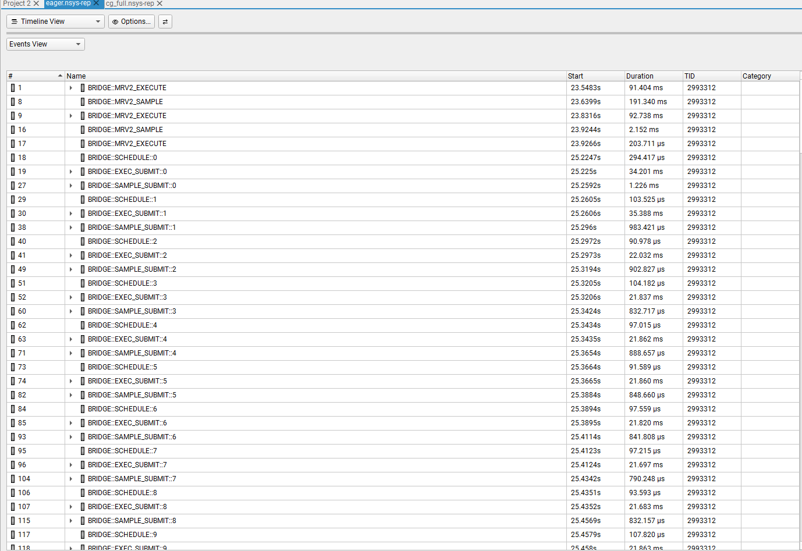

**图 2 正式 Call0 之前的 MRV2 work 与 Call0/1**

**从图中直接看到：**23.x 秒已有若干 MRV2_EXECUTE；25.2247s 才出现 SCHEDULE::0。Call0/1 的 EXEC_SUBMIT 约 34~35ms，Call2 后降到约 21~22ms。

**这一图允许我们得到的结论：**Call0/1 仍含首轮过渡成本；应继续向后找稳定平台。

<table>
<tbody>
<tr class="odd">
<td><p><strong>看这张图是为了什么</strong></p>
<p>验证中段是否真的稳定，而不是偶然挑到一个 21ms 样本。</p></td>
</tr>
</tbody>
</table>

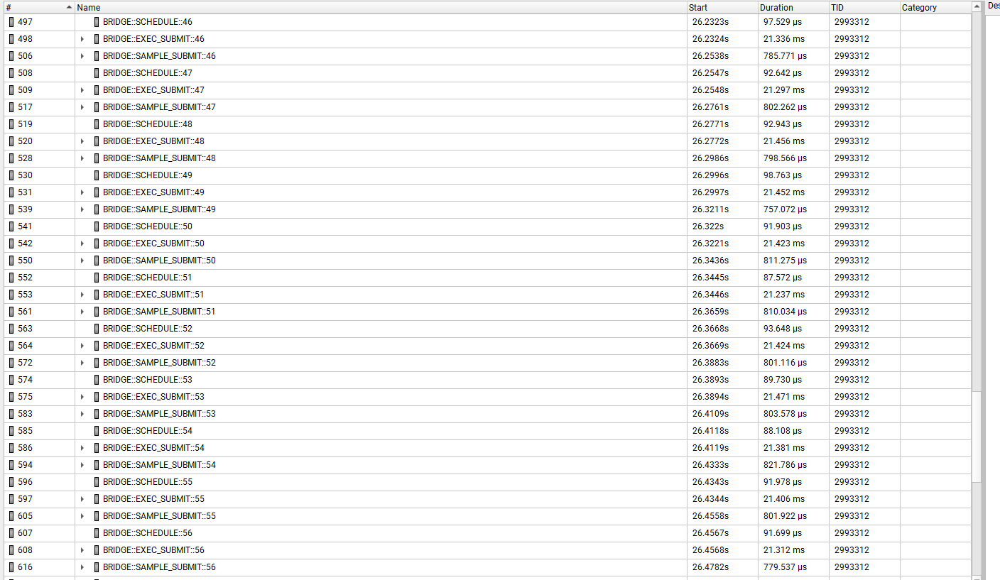

**图 3 Call46~56：steady plateau**

**从图中直接看到：**连续十多个 EXEC_SUBMIT 都约 21.2~21.5ms；SCHEDULE 约 0.09~0.10ms；SAMPLE 约 0.8ms。

**这一图允许我们得到的结论：**这里是非常干净的 steady decode 区域。

<table>
<tbody>
<tr class="odd">
<td><p><strong>看这张图是为了什么</strong></p>
<p>确定稳定区间何时结束，避免把请求结束阶段混入代表性统计。</p></td>
</tr>
</tbody>
</table>

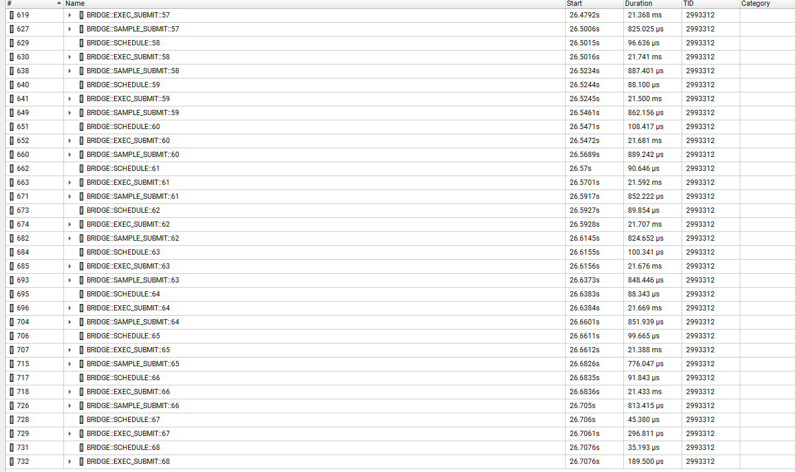

**图 4 Call57~68：尾部 drain 开始**

**从图中直接看到：**Call57~66 仍约 21ms；Call67/68 的 EXEC_SUBMIT 突然降到约 0.2~0.3ms。

**这一图允许我们得到的结论：**Call67/68 已经不是正常 decode forward；稳态样本应选 Call2~66 中部。

<table>
<tbody>
<tr class="odd">
<td><p><strong>为什么最终选 Call50</strong></p>
<p>它位于长时间稳定平台的中部，远离首轮过渡，也远离尾部 drain。我们不是因为“50 这个编号特别”，而是因为它具有代表性。Profiler 分析中，代表性比“第一条能看到的事件”更重要。</p></td>
</tr>
</tbody>
</table>

# 3. Top-down narrowing：先找最大项，再继续向下拆

<table>
<tbody>
<tr class="odd">
<td><p><strong>分析问题</strong></p>
<p>steady iteration 约 22ms，到底是 Scheduler、ModelRunner、Sampling，还是别的阶段占了主要时间？</p></td>
</tr>
</tbody>
</table>

**观察：**Call50：SCHEDULE≈91.9us；EXEC_SUBMIT≈21.423ms；SAMPLE_SUBMIT≈811us。

**推理：**Scheduler 只有约 0.1ms，不可能解释 20ms 量级问题；主要时间进入 EXEC_SUBMIT。

**因此下一步：**展开 EXEC_SUBMIT 内部的 MRV2_EXECUTE，再按 coarse phase 继续分解。

<table>
<tbody>
<tr class="odd">
<td><p><strong>看这张图是为了什么</strong></p>
<p>不是为了看 kernel，而是先把 21ms 的 ModelRunner execute 在 Host 语义层拆成输入准备、Attention 地址/metadata 与模型 forward。</p></td>
</tr>
</tbody>
</table>

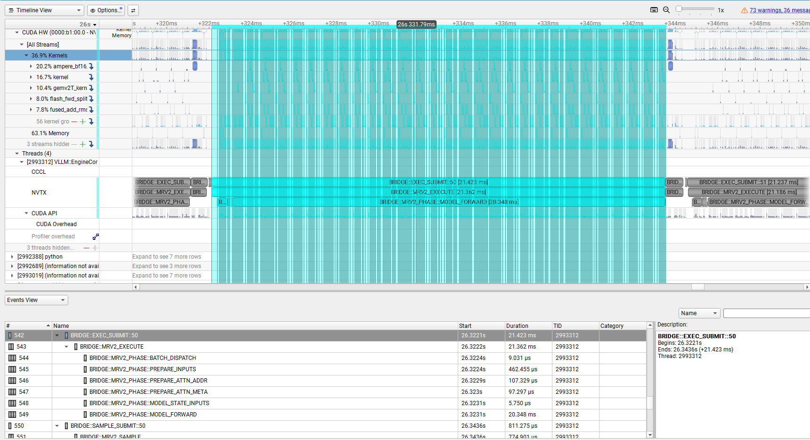

**图 5 Call50 的 MRV2 coarse phase**

**从图中直接看到：**MRV2_EXECUTE=21.362ms；PREPARE_INPUTS=462us；ATTN_ADDR=107us；ATTN_META=97us；MODEL_FORWARD=20.348ms。

**这一图允许我们得到的结论：**约 95% 的 MRV2 wall time 在 MODEL_FORWARD；block table/slot mapping 与 attention metadata 虽然源码复杂，但在这个 workload 下不是 P0。

| **Phase**           | **Duration** | **为什么看它**                          | **得到什么结论**     |
| ------------------- | ------------ | ---------------------------------- | -------------- |
| SCHEDULE            | ≈0.092ms     | 先排除 Scheduler 控制面                  | 不是 20ms 根因     |
| PREPARE_INPUTS     | ≈0.462ms     | 看 CPU input preparation 是否主导       | 存在但远小于 forward |
| PREPARE_ATTN_ADDR | ≈0.107ms     | 验证 block table / slot mapping 是否昂贵 | 不是主瓶颈          |
| PREPARE_ATTN_META | ≈0.097ms     | 验证 Attention metadata 构造是否昂贵       | 不是主瓶颈          |
| MODEL_FORWARD      | ≈20.348ms    | 最大 coarse phase                    | 下一步只分析这里       |

<table>
<tbody>
<tr class="odd">
<td><p><strong>这里体现了性能分析最重要的纪律</strong></p>
<p>“源码复杂”不等于“性能昂贵”。如果某段源码很难，但 NVTX 只有 0.1ms，就先放下它；Profiler 的价值就是把注意力从‘我觉得复杂’转成‘实际时间在哪’。</p></td>
</tr>
</tbody>
</table>

# 4. MODEL_FORWARD≈20ms：先提出三个可能解释

看到 \`MODEL_FORWARD≈20ms\` 后，不能马上说“Python 慢”或“GPU 慢”。至少有三个候选解释：

  - 假设 A：某一个 CUDA API 本身很长，例如 CPU 卡在某次 launch/sync 里。

  - 假设 B：某一个 GPU kernel 很长，例如 GEMM 或 FlashAttention 直接跑了十几毫秒。

  - 假设 C：没有单个长事件，而是大量微秒级 operator/launch/kernel 之间存在 Host/framework 间隙，累计形成 20ms。

<table>
<tbody>
<tr class="odd">
<td><p><strong>看这张图是为了什么</strong></p>
<p>区分上面三个假设：20ms 是一个长 API、一个长 kernel，还是大量细碎事件构成？</p></td>
</tr>
</tbody>
</table>

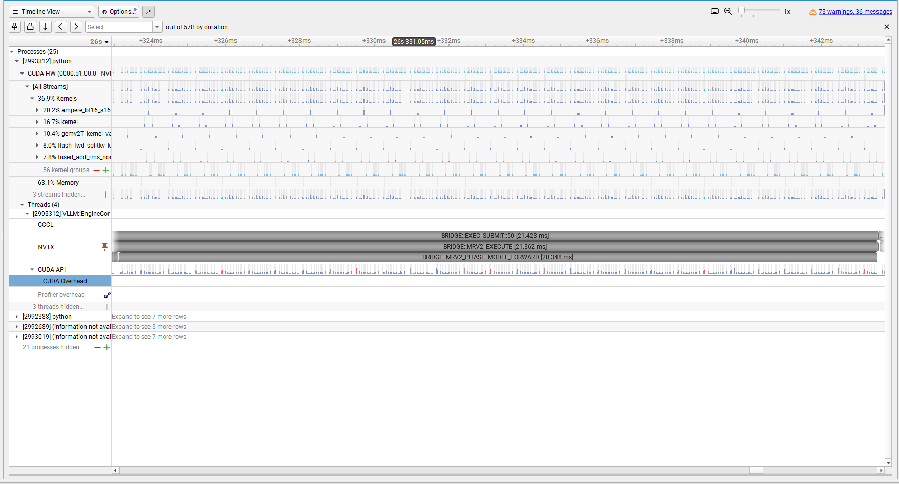

**图 6 Eager MODEL_FORWARD 的 20ms 时间线**

**从图中直接看到：**CUDA API 行是一串细小事件；GPU kernels 也是大量短条；没有一个 API 或 kernel 横跨整个 20ms；kernel 之间存在明显空档。

**这一图允许我们得到的结论：**假设 A/B 不成立；最值得继续验证的是假设 C：Eager per-op host/framework cadence。

## 4.1 为什么“GPU Projection≈20ms”仍然不能说 GPU 算了 20ms

GPU Projection 是从第一个相关 GPU event 到最后一个相关 GPU event 的包络。假设在 20ms 范围里只有 2ms 真正 kernel active、其余是 gap，Projection 仍可能接近 20ms。因此 Projection 适合判断“GPU 相关活动覆盖到哪里”，不适合直接当 active time。

## 4.2 Stats 的作用：证明“launch 多且短”，而不是直接定根因

<table>
<tbody>
<tr class="odd">
<td><p><strong>看这张图是为了什么</strong></p>
<p>用聚合统计确认这份 eager report 是否真的存在大量 kernel launch，以及典型 launch 的量级。</p></td>
</tr>
</tbody>
</table>

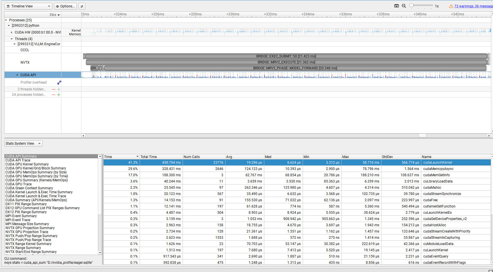

**图 7 CUDA API Summary**

**从图中直接看到：**整份 report 有 23,776 次 cudaLaunchKernel，median≈6.624us；还存在 cuLaunchKernelEx 等其它 launch API。

**这一图允许我们得到的结论：**Launch 的确很多，而且单次 API 是微秒级；但这是全 report 聚合，不能替代 Call50 的局部因果分析。

<table>
<tbody>
<tr class="odd">
<td><p><strong>为什么不能直接做 `20ms - CUDA API - GPU active = Python`</strong></p>
<p>Host API 与 GPU execution 异步重叠；不同 event 的时间区间也可能重叠。简单相减会把异步时间重复扣除或错误归属。正确做法是用 Timeline 和 Correlation ID 判断“下一项 GPU work 为什么没有更早出现”，而不是机械求差。</p></td>
</tr>
</tbody>
</table>

# 5. Correlation ID：第一次把一个 Host launch 和 GPU kernel 真正连起来

到这里我们知道“事件很多而且很短”，但还不知道 CPU 与 GPU 的一一对应关系。Nsight 里最关键的桥是 Correlation ID。它让我们不再靠名字猜。

<table>
<tbody>
<tr class="odd">
<td><p><strong>看这张图是为了什么</strong></p>
<p>得到 Host 端这次 submission 的 duration、Latency、Stream 和 Correlation ID。</p></td>
</tr>
</tbody>
</table>

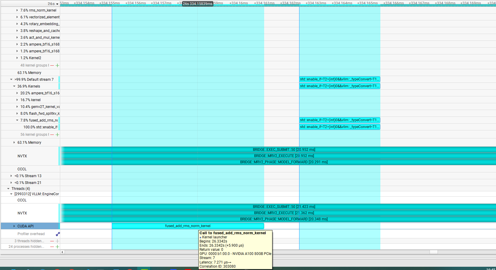

**图 8 CPU 侧 fused_add_rms_norm kernel launcher**

**从图中直接看到：**CPU launcher duration≈5.900us；Latency≈7.271us；Corr=303080；Stream=7。

**这一图允许我们得到的结论：**这是一条典型的微秒级 Eager kernel submission。

<table>
<tbody>
<tr class="odd">
<td><p><strong>看这张图是为了什么</strong></p>
<p>确认前一张 CPU launch 对应的 GPU event，并测量 GPU 真正执行时间。</p></td>
</tr>
</tbody>
</table>

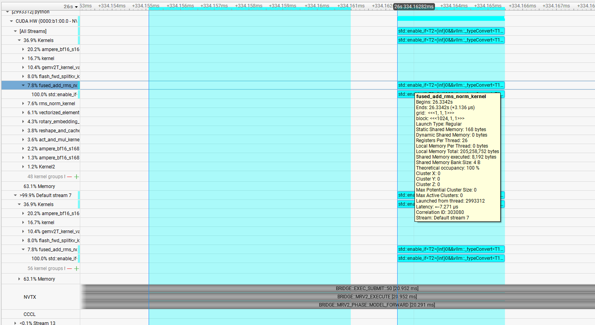

**图 9 GPU 侧 fused_add_rms_norm kernel**

**从图中直接看到：**GPU kernel duration≈3.136us；Corr=303080；Stream=Default stream 7。

**这一图允许我们得到的结论：**CPU 与 GPU 两侧 Corr 完全一致，建立确定的一一对应；GPU kernel 本身只有约 3us。

Host:  
Call to fused_add_rms_norm_kernel  
Duration ≈ 5.900 us  
Corr = 303080  
│  
│ Host→GPU latency ≈ 7.271 us  
▼  
Device:  
fused_add_rms_norm_kernel  
Duration ≈ 3.136 us  
Corr = 303080

## 5.1 三个时间分别回答什么

| **量**                 | **示例**  | **回答的问题**                             |
| --------------------- | ------- | ------------------------------------- |
| CPU launcher duration | 5.900us | Host 在这次 launch API/launcher 内花多久？    |
| Latency               | 7.271us | Host submission 与 GPU event 开始之间相隔多久？ |
| GPU kernel duration   | 3.136us | GPU 真正算这个 kernel 多久？                  |

这三个数不能相加。Latency 是 Host→Device 关联延迟视角，不是一个保证与 API duration 完全不重叠的独立 queue 段。

## 5.2 为什么这组数字已经很可疑

对于 batch1 小模型 decode，GPU kernel 只有 3us，而 Host launch 自己约 6us。也就是说 CPU 为“启动一个极短 GPU 工作”付出的 host-side 成本已经和 GPU compute 同量级甚至更大。若这种模式重复数百次，Host/framework cadence 很容易成为系统级瓶颈。

但一条 kernel 还不足以证明 20ms 的 gap 都来自 Host。下一步必须看“相邻两个 kernel 之间，CPU 何时提交下一项”。

# 6. Kernel gap 分析：怎样区分 Host late-submit 与 GPU queue

这是整个 Eager 根因分析里最关键的一步。只看到 GPU 上有空白还不够，因为空白可能有两种完全不同的来源。

我们只需要三个时间点：  
  
K1_end 前一个 GPU kernel 结束  
Launch_K2_begin 下一个 kernel 的 Host launch 开始  
K2_begin 下一个 GPU kernel 真正开始  
  
如果：  
K1_end \< Launch_K2_begin \< K2_begin  
→ GPU 已经没有前一个 work，但 Host 还没有提交下一项  
→ Host/framework late submission  
  
如果：  
Launch_K2_end \< K1_end \< K2_begin  
→ Host 已经提前把 K2 enqueue  
→ gap 更可能来自 stream dependency / queue / device scheduling

<table>
<tbody>
<tr class="odd">
<td><p><strong>看这张图是为了什么</strong></p>
<p>把 20ms 再放大到几百微秒，使 GPU kernel 和 CPU CUDA API 的相对位置可以肉眼比较。</p></td>
</tr>
</tbody>
</table>

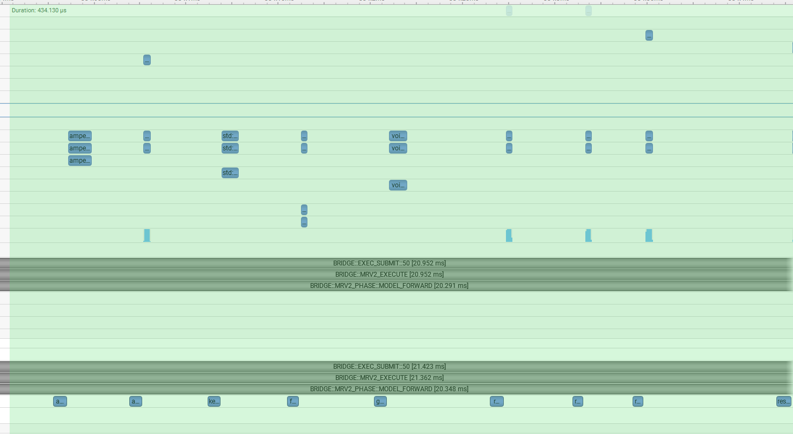

**图 10 约 400us 的 Eager 局部窗口**

**从图中直接看到：**GPU 上出现一串极短 kernel；CPU CUDA API 也按几十微秒 cadence 出现，并不是提前堆积一大串 launch。

**这一图允许我们得到的结论：**视觉上已经开始支持 Host producer 跟不上 tiny-kernel consumer，但仍需用两条具体事件验证。

<table>
<tbody>
<tr class="odd">
<td><p><strong>看这张图是为了什么</strong></p>
<p>测出前一个 kernel 的结束位置与 duration。</p></td>
</tr>
</tbody>
</table>

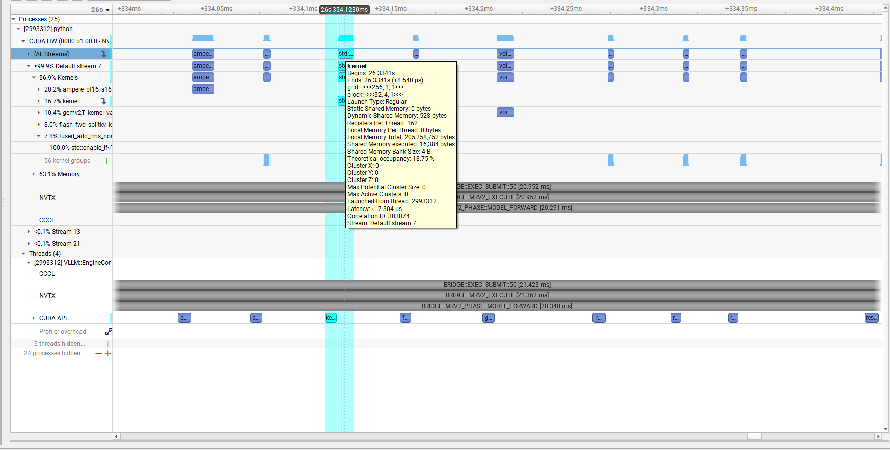

**图 11 K1 GPU event：duration≈8.640us / Corr=303074**

**从图中直接看到：**K1 是典型的微秒级 kernel。

**这一图允许我们得到的结论：**它本身不可能解释几十微秒到更大的空档。

<table>
<tbody>
<tr class="odd">
<td><p><strong>看这张图是为了什么</strong></p>
<p>确认 K1 的 Host submission 量级，作为和下一项 K2 的时序比较基准。</p></td>
</tr>
</tbody>
</table>

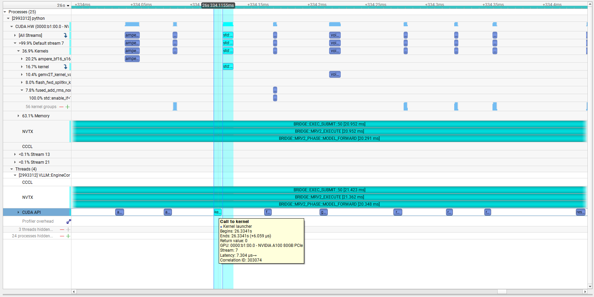

**图 12 K1 对应 Host launcher：duration≈6.059us / latency≈7.304us**

**从图中直接看到：**Host launch 与 GPU kernel 都是微秒级；Host→GPU 关联 latency 仍较小。

**这一图允许我们得到的结论：**如果后面出现几十微秒 gap，就不能简单归因于单次 launch API 或 kernel 本身。

<table>
<tbody>
<tr class="odd">
<td><p><strong>看这张图是为了什么</strong></p>
<p>得到下一项 GPU work 的真实开始位置与 device duration。</p></td>
</tr>
</tbody>
</table>

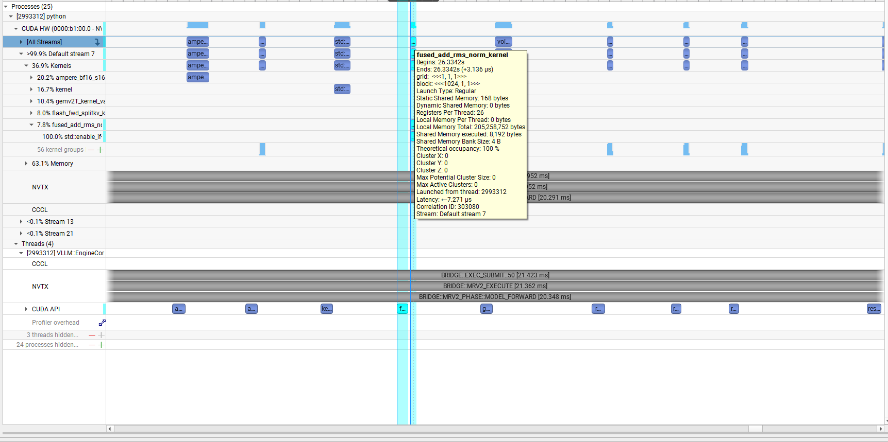

**图 13 K2 GPU fused_add_rms_norm：duration≈3.136us / Corr=303080**

**从图中直接看到：**K2 仍然是极短 GPU kernel。

**这一图允许我们得到的结论：**GPU compute 不是 gap 的主量级。

<table>
<tbody>
<tr class="odd">
<td><p><strong>看这张图是为了什么</strong></p>
<p>比较 K1 已结束后，Host 是不是很晚才开始 launch K2。</p></td>
</tr>
</tbody>
</table>

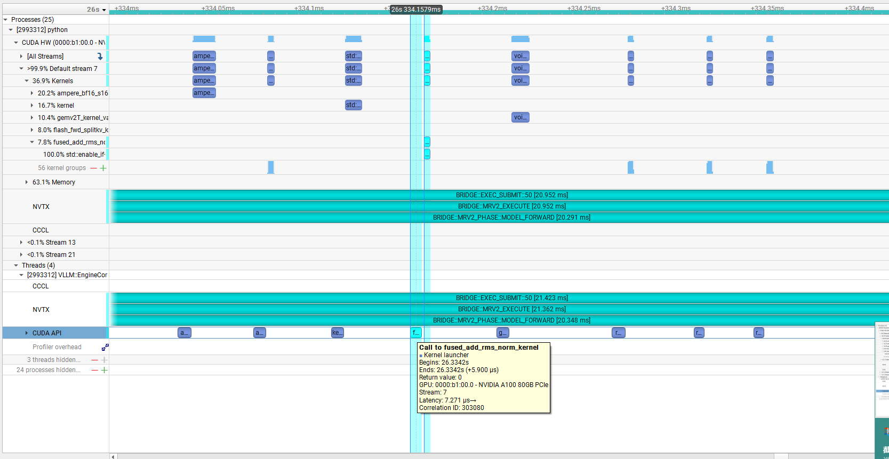

**图 14 K2 Host launcher：duration≈5.900us / latency≈7.271us**

**从图中直接看到：**局部 Timeline 可见 K1 结束与 K2 Host launch 之间仍存在明显空档；K2 一旦 launch，GPU 很快开始。

**这一图允许我们得到的结论：**这更符合 Host/framework late submission，而不是 K2 已经在 GPU queue 里等待很久。

## 6.1 这一步为什么比“kernel 很短”更重要

“kernel 很短”只能说明 device work 小；“kernel 之间有 gap”只能说明 GPU event 不连续；只有再证明“下一次 Host launch 发生得也很晚”，才能把 gap 的来源指向 Host/framework producer cadence。

这就是从相关性升级为因果时序判断的关键一步。

<table>
<tbody>
<tr class="odd">
<td><p><strong>Eager 根因的准确表述</strong></p>
<p>不是“cudaLaunchKernel 一次就很慢”，也不是“GPU kernel 本身慢”。真正的问题是：在 Eager per-op 执行里，Python / PyTorch Dispatcher / native wrapper / operator preparation / launch 这整条 Host/framework 路径反复出现，使下一项 tiny GPU work 经常不能足够早地被提交。</p></td>
</tr>
</tbody>
</table>

# 7. CUDA Graph 从零开始：它到底解决什么问题

如果这是第一次接触 CUDA Graph，可以先完全忘掉 vLLM。先从一个普通 CUDA 程序的重复执行模式理解。

## 7.1 为什么普通 Eager/逐次 Launch 会有 Host 开销

假设每个 iteration 固定执行 6 个 GPU 工作：  
  
K1 → K2 → K3 → K4 → K5 → K6  
  
普通方式每次 iteration 都要让 CPU 重走：  
  
prepare K1 → launch K1  
prepare K2 → launch K2  
prepare K3 → launch K3  
...  
prepare K6 → launch K6  
  
如果每个 kernel 很大，例如 2ms：  
Host 每次多花 5~10us，影响可能不明显。  
  
如果每个 kernel 只有 3~10us：  
Host preparation / dispatch / launch 与 GPU compute 同量级，  
GPU 很容易在两次工作之间等 Host。

这正是我们在 Qwen3-0.6B / A100 / batch1 eager decode 中观察到的形态：模型很小、每个 kernel 极短、Host 要处理的 operator 数又很多。

## 7.2 CUDA Graph 的核心思想：把“重复提交序列”记录下来

CUDA Graph 不是新的数学算法。它做的是：如果某一段 GPU 工作的结构在后续 iteration 中基本重复，就把这段 GPU 工作及依赖关系先记录成一个 Graph，之后不再让 CPU 每次逐个重走数百次 launch。

第一次（概念上）：  
  
CPU:  
K1 launch  
K2 launch  
K3 launch  
...  
Kn launch  
↓  
CUDA 记录这些工作及依赖关系  
↓  
Graph  
  
之后：  
Graph  
↓ instantiate  
GraphExec  
↓  
  
每次 steady iteration：  
CPU  
↓  
cudaGraphLaunch(GraphExec)  
↓  
GPU replay K1...Kn

## 7.3 Graph、GraphExec、cudaGraphLaunch 分别是什么

| **术语**          | **可以怎么理解**                               | **本次 GUI 示例**              |
| --------------- | ---------------------------------------- | -------------------------- |
| Graph           | “工作依赖图”的描述；里面有 kernel、memcpy、依赖边等节点/关系   | Graph 13                   |
| GraphExec       | Graph instantiate 后真正可重复 launch 的可执行实例   | GraphExec 14               |
| cudaGraphLaunch | CPU 侧把 GraphExec enqueue 到某条 CUDA stream | steady 约 57.5us 的 Host API |
| Graph replay    | GPU 按已经捕获的依赖关系执行里面的工作                    | 橙色 Graph 13 (GraphExec 14) |

## 7.4 为什么需要 instantiate / GraphExec

可以把 Graph 看成“结构描述”，GraphExec 看成“已经准备好可以重复执行的版本”。instantiate 阶段可以完成一些一次性的准备，因此 steady replay 不需要每轮重新建立整张工作图。

这也是为什么 first-use 的 GraphLaunch/Graph setup 可能明显比 steady replay 贵：cold path 与 steady path 必须分开。

## 7.5 Graph 不是把所有 kernel 融合成一个 kernel

GraphExec 里面仍然可能是：  
  
RMSNorm kernel  
↓  
QKV GEMM  
↓  
RoPE kernel  
↓  
KV write  
↓  
FlashAttention  
↓  
O projection  
↓  
MLP kernels  
↓  
...  
  
这些 kernel 仍然存在。  
变化的是“谁来逐个提交它们”。  
  
Eager：  
CPU 每一轮逐个走 operator/launch  
  
CUDA Graph：  
CPU 只做 graph launch  
CUDA runtime/device replay 已捕获的工作图

## 7.6 Graph 与 FlashAttention 完全不是一个层次

| **技术**                            | **解决的问题**                                   | **本实验中是否变化**              |
| --------------------------------- | ------------------------------------------- | ------------------------- |
| FlashAttention 2                  | Attention 这个 operator/kernel 怎么更高效          | Eager 与 cg_full 都保持 FA2  |
| CUDA Graph                        | 一大串 GPU work 如何低 Host 开销地重复提交               | NONE → FULL               |
| VLLM_COMPILE / torch.compile 类优化 | 计算图捕获、fusion、codegen、shape specialization 等 | Eager/cg_full 对照中保持 NONE |

因此 \`Eager vs FlashAttention\` 是错误的比较维度；正确理解是：Eager/Graph 是执行/提交方式，FA2 是 Attention backend。

## 7.7 Graph 为什么是异步的

\`cudaGraphLaunch()\` 的语义本质上是把 GraphExec enqueue 到某个 CUDA stream。它通常不要求 CPU 等 Graph 里的所有 GPU 工作完成后才能返回。

CPU:  
prepare  
↓  
cudaGraphLaunch(GraphExec)  
↓  
Host API 返回  
↓  
CPU 可以继续做 sampling / 准备后续工作  
  
GPU:  
GraphExec 开始  
█████████████████  
仍然在执行

这点非常重要，因为后面 GUI 会出现 \`MRV2_EXECUTE\` Host range 已结束，但 GPU Graph 还在继续。这不是异常，而是 CUDA 异步执行的正常表现。

## 7.8 Graph 仍然服从 CUDA Stream 顺序

Graph 被 launch 到 Default stream 7 后，不会绕过这个 stream 前面已经 enqueue 的工作。若 stream 中前序 kernel/memcpy/graph 尚未完成，新的 GraphExec 会排在后面。

CPU 已经：  
cudaGraphLaunch(Graph N+1)  
↓ enqueue  
  
GPU Stream 7:  
Graph N / prior work ███████████  
↓  
Graph N+1 才开始

因此 Graph 模式下出现较大的 \`GraphLaunch → GPU Graph start\` latency，不一定意味着 Host 又慢了；它可能表示 Host 已经跑到 GPU 前面，GPU 还在消费 stream 前序 work。

## 7.9 为什么 Graph 对动态 LLM Runtime 不是“任何地方都能直接套”

LLM inference 有动态 batch、不同 sequence length、不同 token 数、KV block table 等动态状态。Graph replay 要求被 capture 的执行结构在 replay 时满足其约束。因此 production runtime 通常需要按可支持的 shape/batch 情况管理不同 graph，或者保留部分 eager/piecewise path。

本实验 \`cg_full\` 的意义不是证明“所有 LLM workload 都能整段 Full Graph”，而是为当前固定 decode workload 构造一个干净的机制对照：CompilationMode 保持 NONE，只打开 FULL CUDA Graph。

## 7.10 \`FULL\` 为什么仍会看到普通 CUDA API / kernel

\`FULL\` 不是“整个 EngineCore.step() 全部被 graph 化”。Scheduler、prepare_inputs、sampling、result reconciliation、某些 runtime 辅助工作仍然在 graph 外。FULL 更接近“满足条件的 full-model execution 使用 Graph”，所以 GUI 同时出现 GraphExec 和少量普通 kernel/API 是正常的。

# 8. 从 GUI 看 Graph：Eager 的 20ms 为什么突然变成约 1ms

<table>
<tbody>
<tr class="odd">
<td><p><strong>分析问题</strong></p>
<p>如果 Eager 根因真的是“per-op Host/framework submission”，那么只改变 CUDA Graph 后，应该看到什么？</p></td>
</tr>
</tbody>
</table>

**观察：**预期 Host 侧数百次逐 kernel submission 被压缩为少量 graph launch；GPU 仍执行模型 kernels，但以 GraphExec replay 的方式出现；MRV2 Host wall 应大幅下降。

**推理：**这是一项 mechanism intervention：如果机制变化和性能变化同时出现，根因证据就从‘观察性相关’升级为‘受控验证’。

**因此下一步：**打开 cg_full 的 steady Call，观察 MRV2、CUDA API 与 GPU Graph。

<table>
<tbody>
<tr class="odd">
<td><p><strong>看这张图是为了什么</strong></p>
<p>验证打开 FULL CUDA Graph 后，Host ModelRunner 路径是否从 20ms Eager forward 变成一次 Graph replay。</p></td>
</tr>
</tbody>
</table>

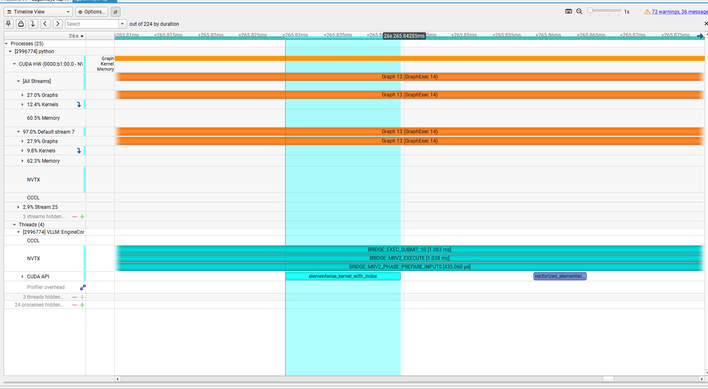

**图 15 cg_full steady Call50**

**从图中直接看到：**MRV2_EXECUTE≈1.038ms；PREPARE_INPUTS≈435us；GPU 上出现明显的橙色 \`Graph 13 (GraphExec 14)\`。

**这一图允许我们得到的结论：**原来 20ms 的 per-op model-forward Host path 被大幅压缩；prepare_inputs 基本没变，却因大瓶颈消失而变成显著比例。

## 8.1 为什么这里看不到原来的 MODEL_FORWARD NVTX

不是“模型 forward 消失了”。我们此前的 \`MODEL_FORWARD\` NVTX patch 包在 Eager 分支的 \`self.model(\*\*model_inputs)\` 周围；Graph path 走 replay 分支，没有经过同一个被包住的 statement。因此这条 NVTX 不再出现。

真正的模型 device work 现在体现在 GPU 上的 \`Graph 13 (GraphExec 14)\` 中。

## 8.2 这张图最重要的数字不是 1.038ms 本身，而是比例变化

| **指标**          | **Eager**         | **cg_full**     | **说明**                   |
| --------------- | ----------------- | ---------------- | ------------------------ |
| MRV2_EXECUTE   | ≈21.36ms          | ≈1.04ms          | Host execute path 大幅缩短   |
| PREPARE_INPUTS | ≈0.46ms           | ≈0.44ms          | 本身几乎没变                   |
| 模型提交            | 数百次 per-op launch | 主要变成 GraphLaunch | 正中 Eager 根因              |
| FA2             | 仍使用               | 仍使用              | Attention backend 不是这次变量 |

这就是 bottleneck migration 的第一眼：优化前 PREPARE_INPUTS 只有 2% 左右，优化后它突然接近 MRV2 的四成。不是它变慢，而是原来 20ms 的大项被删除。

# 9. GPU GraphExec：为什么 Host 只有 1ms，但 GPU Graph 跑了约 1.9ms

<table>
<tbody>
<tr class="odd">
<td><p><strong>看这张图是为了什么</strong></p>
<p>理解 Host MRV2 结束与 GPU 模型执行完成为什么不是同一个时间点。</p></td>
</tr>
</tbody>
</table>

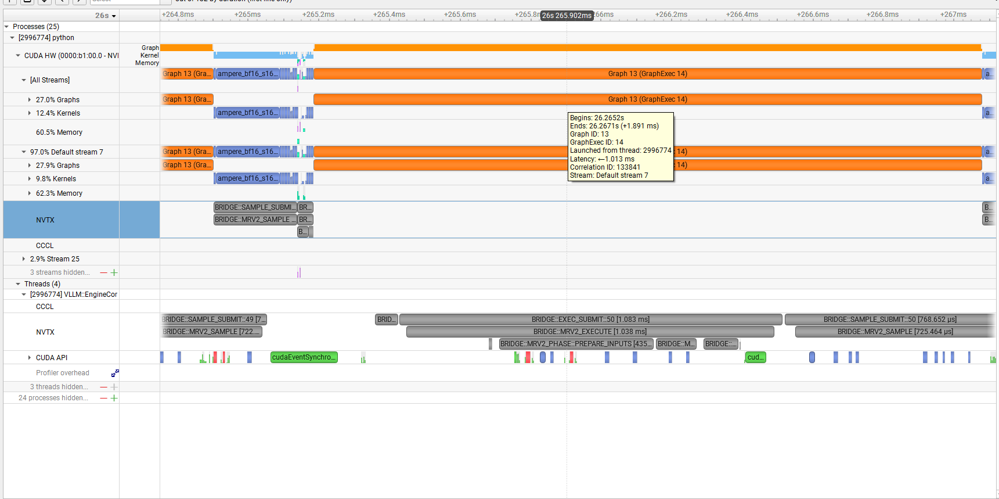

**图 16 GPU Graph13 (GraphExec14)：duration≈1.891ms / Corr=133841**

**从图中直接看到：**GPU Graph13 约 1.891ms；Tooltip 显示 Corr=133841、Default stream 7、Latency≈1.013ms。

**这一图允许我们得到的结论：**GPU 仍真实执行约 1.9ms 模型工作；CUDA Graph 主要消除 Host submission，不会让 device compute 归零。

## 9.1 为什么 \`MRV2_EXECUTE≈1ms \< GPU Graph≈1.9ms\` 完全合理

Host:  
PREPARE_INPUTS  
↓  
cudaGraphLaunch  
↓  
MRV2_EXECUTE return ~1ms  
  
GPU:  
GraphExec14 starts  
███████████████████ ~1.9ms  
仍在继续

CPU 只负责 enqueue，不必等 device 完成。因此 Host 可以先离开 execute path。这个现象正是 CUDA 异步执行的直接证据。

## 9.2 为什么端到端只提升约 7.9×，而 MRV2 Host 侧能缩短约 20×

因为优化后新的 critical path 不再是 Host model submission。GPU Graph 还需要约 1.9ms，另外 sampling、scheduler、result coordination、同步点等仍然存在。

优化前：  
Host framework/model submission ≈ 20ms ← P0  
GPU compute ~少量  
其他成本 ~更小  
  
优化后：  
Host submission ≈ 1ms  
GPU Graph replay ≈ 1.9ms ← 相对更重要  
sampling / runtime coordination ← 相对更重要  
  
所以：  
Host MRV2 speedup 可以约 20×  
但端到端 TPS 不会等比例变成 20×。

# 10. CPU cudaGraphLaunch ↔ GPU GraphExec：把 Graph 链真正用 Correlation ID 对上

和普通 kernel 一样，Graph 也不能只靠名字和横轴位置猜对应关系。仍然要用 Correlation ID。

<table>
<tbody>
<tr class="odd">
<td><p><strong>看这张图是为了什么</strong></p>
<p>说明 first-use/cold GraphLaunch 可能远慢于 steady replay，为什么不能拿第一条事件做性能结论。</p></td>
</tr>
</tbody>
</table>

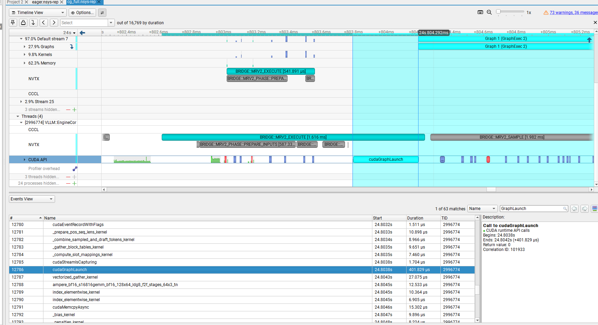

**图 17 较早的一次 cudaGraphLaunch：约 401.829us**

**从图中直接看到：**Start≈24.8038s，duration≈401.829us，Corr=101933；这是 GraphLaunch 搜索结果中的早期匹配。

**这一图允许我们得到的结论：**早期 GraphLaunch 可以用于理解机制，但不能代表 steady decode。

为什么 first-use 可能更贵？在第一次真正使用 GraphExec 的附近，runtime 可能仍有一次性 setup、lazy initialization、cache warming 等工作。我们不需要把这 401us 精确归因到某一个内部动作；只要通过后续 steady 样本证明它不是稳定成本即可。

<table>
<tbody>
<tr class="odd">
<td><p><strong>看这张图是为了什么</strong></p>
<p>找到与 GPU Graph13 完全对应的 steady Host launch，并得到真实 steady graph-launch 量级。</p></td>
</tr>
</tbody>
</table>

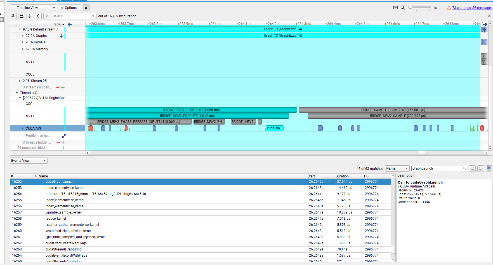

**图 18 steady cudaGraphLaunch：duration≈57.544us / Corr=133841**

**从图中直接看到：**CPU cudaGraphLaunch Start≈26.2642s，duration≈57.544us，Corr=133841；GPU Graph13 同样 Corr=133841。

**这一图允许我们得到的结论：**Host→GPU Graph 链被严格闭合：一次几十微秒的 Host GraphLaunch，触发约 1.9ms 的 GPU GraphExec replay。

Host:  
cudaGraphLaunch  
Start ≈ 26.2642s  
Duration ≈ 57.544us  
Corr = 133841  
│  
│ Graph launch → GPU Graph begin ≈ 1.013ms  
▼  
GPU:  
Graph 13 (GraphExec 14)  
Start ≈ 26.2652s  
Duration ≈ 1.891ms  
Corr = 133841

## 10.1 为什么 GraphLaunch→GPU start latency 约 1ms，不代表 CUDA Graph 又变慢了

关键是：GraphLaunch 已经把 work enqueue 到 Default stream 7；GPU 何时开始还取决于 stream 前面是否有尚未完成的工作。

CPU:  
cudaGraphLaunch(Graph13)  
→ work 已进入 stream queue  
→ CPU 继续  
  
GPU Default stream 7:  
\[previous work / graph\]  
██████████████████  
↓  
Graph13 才开始  
█████████████

这与 Eager 的 gap 完全不同：Eager 中很多时候是前一个 kernel 已结束，但 Host 还没提交下一项；Graph 模式则可能是 Host 已经提前提交，GPU 仍在按 stream 顺序消费前序 work。

# 11. 为什么会看到“正在执行一个 Graph，CPU 又在 launch 另一个 Graph”

<table>
<tbody>
<tr class="odd">
<td><p><strong>看这张图是为了什么</strong></p>
<p>解释初学者最容易误读的画面：是不是同一 Graph 执行到一半又被重复 launch？</p></td>
</tr>
</tbody>
</table>

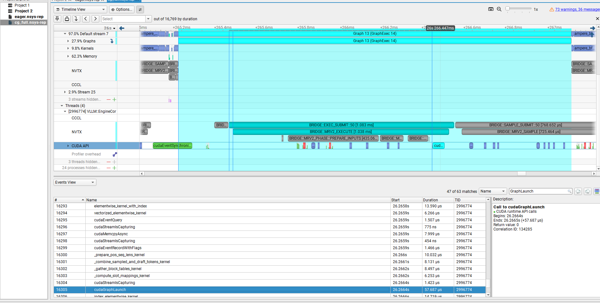

**图 19 GPU Graph 正在执行时，CPU 行又出现新的 cudaGraphLaunch**

**从图中直接看到：**当前 GPU Graph13 的 Corr=133841，而画面中另一次 Host cudaGraphLaunch 的 Corr=134285，两者不同。

**这一图允许我们得到的结论：**它们不是同一条 Host→GPU 链；CPU 很可能正在提前 enqueue 后续 graph/work。

## 11.1 为什么 CPU 可以提前 launch 下一份 Graph

CUDA launch 是异步的。只要程序依赖关系允许，CPU 不需要等 GPU 当前 Graph 完成，完全可以继续准备下一批输入、发起下一次 GraphLaunch。

CPU:  
Launch Graph N  
↓  
继续运行  
↓  
Launch Graph N+1  
↓  
继续运行  
  
GPU Stream 7:  
Graph N █████████████████  
Graph N+1 █████████████

同一 stream 的顺序语义保证 Graph N+1 不会跑到 Graph N 前面，因此 Host 提前 enqueue 是安全且有意义的。

## 11.2 为什么这是一个“系统平衡改变”的信号

| **Eager**                                           | **CUDA Graph**                                          |
| --------------------------------------------------- | ------------------------------------------------------- |
| Host producer 慢：GPU tiny kernel 结束后，下一项 work 可能还没生成 | Host producer 变快：可以在 GPU 还执行前序 graph 时就 enqueue 后续 work |
| GPU 常等 Host                                         | Host 有机会跑到 GPU 前面                                       |
| kernel gap 主要值得查 late submission                    | 新的 latency 可能来自 stream queue / 前序 GPU work              |

这就是为什么打开 Graph 后，性能分析问题会改变：不再首先问“Host 为什么这么晚才 launch”，而会开始问“GPU queue、stream dependency、device work 谁成为新的 critical path”。

<table>
<tbody>
<tr class="odd">
<td><p><strong>看这种图时的固定规则</strong></p>
<p>看到 GraphLaunch 与 GPU Graph 时间重叠，第一步永远不是按横轴猜关系，而是先比较 Correlation ID。Corr 相同才是一条 Host→GPU Graph 链；Corr 不同通常表示不同 graph/work。</p></td>
</tr>
</tbody>
</table>

# 12. Eager vs cg_full：把两张代表图放在一起理解

| **维度**                | **Eager**                         | **cg_full**                   |
| --------------------- | --------------------------------- | ------------------------------ |
| Compilation           | NONE                              | NONE                           |
| CUDA Graph            | NONE                              | FULL                           |
| Attention             | FA2                               | FA2                            |
| Host model submission | 数百次 per-op path / launch          | 一次主要 GraphLaunch + 少量外围 work   |
| 典型 Host event         | 单 launch ~5~7us                 | steady GraphLaunch ~57.5us    |
| GPU work              | 大量 3~10us tiny kernels，中间有明显 gap | GraphExec replay 中执行模型 kernels |
| MRV2_EXECUTE         | ≈21ms                             | ≈1ms                           |
| 端到端吞吐                 | ≈50.58 tok/s                      | ≈401.36 tok/s                  |

## 12.1 为什么这是一组很干净的根因验证

两边都保持 CompilationMode.NONE，因此没有同时打开 torch.compile/VLLM_COMPILE；Attention backend 也保持 FA2。核心变化只有 \`CUDAGraphMode.NONE → FULL\`。

如果我们此前把 Eager 根因判断错了，例如真正瓶颈是 FlashAttention kernel 本身，那么只改变提交方式不应该让 MRV2 从约 21ms 降到约 1ms，也不应该得到约 7.9× 的端到端吞吐提升。

而实际观察到：

  - 机制层变化：数百个 per-op launch → GraphLaunch / GraphExec replay。

  - Host 时间变化：MRV2 约 21ms → 约 1ms。

  - 性能变化：约 50.58 tok/s → 约 401.36 tok/s。

机制变化与性能变化方向完全一致，因此这是 root-cause verification，而不仅是“两个指标相关”。

## 12.2 default 为什么更快，但不能用来单独归因 compile

| **Case** | **Compilation** | **Graph mode**       | **吞吐**        |
| -------- | --------------- | -------------------- | ------------- |
| eager    | NONE            | NONE                 | ≈50.58 tok/s  |
| cg_full | NONE            | FULL                 | ≈401.36 tok/s |
| default  | VLLM_COMPILE   | FULL_AND_PIECEWISE | ≈462.43 tok/s |

\`cg_full → default\` 同时改变 CompilationMode 和 Graph policy，因此额外约 15% 收益不能简单写成“全部来自 VLLM_COMPILE”。如果未来要精确拆开，需要 2×2 factorial：NONE/NONE、NONE/FULL、VLLM_COMPILE/NONE、VLLM_COMPILE/FULL。

# 13. 最终瓶颈结论：从“GPU 看起来不忙”到 Host/framework submission root cause

证据链：  
  
1. steady iteration ≈22ms  
2. Scheduler ≈0.09ms → 排除 Scheduler  
3. MRV2_EXECUTE ≈21ms  
4. prepare_inputs / attn addr / metadata \<1ms → 排除准备阶段  
5. MODEL_FORWARD ≈20ms → 最大项  
6. 没有单个 20ms CUDA API / GPU kernel  
7. 单个 Host launch ~5~7us  
8. 单个 GPU tiny kernel ~3~9us  
9. kernel 间有几十us gap  
10. 下一次 Host launch 常发生在前一个 GPU kernel 完成之后较晚的位置  
11. → Eager per-op Host/framework cadence  
12. 只开 FULL CUDA Graph  
13. per-op launch → GraphLaunch / GraphExec  
14. MRV2 ≈21ms → ≈1ms  
15. TPS ≈50.6 → ≈401.4  
16. → 根因闭环成立

<table>
<tbody>
<tr class="odd">
<td><p><strong>最终准确表述</strong></p>
<p>在 Qwen3-0.6B / A100 / batch1 / Eager 的 steady decode 中，主要问题不是 Scheduler、Paged-KV 地址准备、Attention metadata，也没有证据支持 FlashAttention kernel 本身是 P0。主要 wall time 位于 Eager model-forward 的 per-op Host/framework submission path：Python/PyTorch Dispatcher/native wrapper/operator preparation/launch 反复出现，导致 GPU tiny kernels 之间存在明显 late-submission gap。CUDA Graph 通过 capture/replay 把数百次逐 op 提交压缩为 GraphLaunch，从而显著降低该 Host critical path。</p></td>
</tr>
</tbody>
</table>

## 13.1 Bottleneck Migration：优化以后为什么还要重新 profile

优化从来不是“把所有时间都消掉”。CUDA Graph 把最大的 Host bottleneck 打掉以后，系统中原本较小的成本会变成新的主要占比。

| **优化前**                            | **优化后**                                                       |
| ---------------------------------- | ------------------------------------------------------------- |
| MODEL_FORWARD Host path≈20ms，压倒一切 | Host MRV2≈1ms                                                 |
| PREPARE_INPUTS≈0.46ms 几乎不显眼       | PREPARE_INPUTS≈0.44ms 成为显著占比                                 |
| GPU compute 相对隐藏在 Host 慢路径后        | GPU Graph≈1.9ms 成为新的主要 device cost                            |
| 重点查 Host late-submit               | 下一步更值得查 GPU graph 内 kernel、sampling、sync、runtime coordination |

# 14. 以后拿到一个陌生 .nsys-rep，照这个 SOP 走

**1. 确认 payload：**先确认 report 真的有 NVTX、CUDA Runtime、Kernel/Graph activity。多进程框架还要确认 profiler 覆盖了真正执行 GPU 的 child process。

**2. 认地图：**找真正的 GPU process、EngineCore/Worker thread、NVTX、CUDA API、CUDA HW。

**3. 分阶段：**把 init/warmup/first iteration/steady/drain 分开。不要用第一条事件代表稳态。

**4. 选代表窗口：**在稳定 plateau 中间选一个 Call。

**5. Top-down narrowing：**先从业务 range 的最大项开始拆：SCHEDULE→EXEC→MRV2→phase。

**6. Host vs Device：**看是否存在单个长 CUDA API / kernel；若没有而是大量 tiny event，则继续做 cadence 分析。

**7. Correlation ID：**任意一个 Host launch 都通过 Corr 找到对应 GPU event。

**8. 看 gap 的来源：**比较 K1_end、Launch_K2_begin、K2_begin，区分 late-submit 与 queue/dependency。

**9. 形成机制假设：**不要只写‘GPU 利用率低’，要写清楚‘为什么低’。

**10. 做单变量 A/B：**用最小机制干预验证，例如只开启 CUDA Graph。

**11. 重新 profile：**检查原 bottleneck 是否消失，以及新的 critical path 出现在哪里。

## 14.1 一张“症状 → 下一步”的决策表

| **你在 Timeline 看到什么**                      | **更像什么问题**                      | **下一步**                                |
| ----------------------------------------- | ------------------------------- | -------------------------------------- |
| 一个 kernel 特别宽                             | Device kernel bound             | NCU / GPU Metrics                      |
| 大量 tiny kernel + 大 gap + Host late launch | Host/framework cadence          | CUDA Graph / compile / fusion A/B      |
| Host 已提前提交，但 GPU event 很晚才开始              | queue / dependency / contention | 看 stream、sync、其它进程、GPU queue           |
| 大块 H2D/D2H/MemOps                         | 数据搬运主导                          | 看 bytes、方向、是否可 overlap/减少              |
| Scheduler NVTX 本身很长                       | CPU runtime/control-plane       | CPU sampling / Python/native profiling |
| GraphLaunch 很快、GPU Graph 很长               | Host bottleneck 已消除，Device 更重要  | Graph 内 kernel / NCU                   |

# 附录 A. 本次关键数字

| **对象**                  | **观测值**       |
| ----------------------- | ------------- |
| Call50 SCHEDULE         | ≈91.9us       |
| Call50 EXEC_SUBMIT     | ≈21.423ms     |
| Call50 SAMPLE_SUBMIT   | ≈811us        |
| MRV2_EXECUTE           | ≈21.362ms     |
| MODEL_FORWARD          | ≈20.348ms     |
| PREPARE_INPUTS         | ≈462us        |
| ATTN_ADDR / ATTN_META | ≈107us / 97us |
| 典型 Eager Host launch    | ≈5~7us       |
| 典型 GPU tiny kernel      | ≈3~9us       |
| 局部 Host→GPU latency     | ≈7us 量级       |
| cg_full MRV2           | ≈1.0ms        |
| steady cudaGraphLaunch  | ≈57.544us     |
| GPU Graph13 replay      | ≈1.891ms      |
| Eager throughput        | ≈50.58 tok/s  |
| cg_full throughput     | ≈401.36 tok/s |
| default throughput      | ≈462.43 tok/s |

# 附录 B. 初学 CUDA Graph 最容易混淆的 10 个问题

**Graph 是不是一个大 kernel？** 不是。Graph 里面仍然有很多 kernel/memcpy 等 node；它主要改变提交方式与依赖重放方式。

**Graph 会不会替换 FlashAttention？** 不会。FA2 仍是 Attention backend；Graph 只是让包含 FA2 在内的一串工作被 replay。

**cudaGraphLaunch 返回后 GPU 就完成了吗？** 通常没有。Launch 是异步 enqueue，GPU 可以继续执行很久。

**为什么 Host MRV2 1ms，但 GPU Graph 1.9ms？** Host 只完成 submission 就可以返回；Device execution 独立继续。

**为什么 GraphLaunch→GPU start latency 还能有 1ms？** Graph 被 enqueue 到 stream 后仍要等待前序 stream work。

**为什么一个 Graph 还没结束，CPU 又出现 GraphLaunch？** CPU 可以提前 enqueue 后续 graph；先用 Corr ID 判断是不是同一个 graph。

**FULL 为什么还有普通 kernel/API？** FULL 不是整个 vLLM runtime 全 capture；prepare/sampling/外围 runtime 仍在 graph 外。

**第一条 GraphLaunch 为什么 400us，steady 只有几十us？** first-use/cold path 与 steady replay 不同，不能用第一条代表稳态。

**Graph 就一定让 GPU kernel 更快吗？** 不一定。它主要减少 Host submission；单个 kernel 的 device duration可能基本不变。

**Graph 后下一步还看什么？** 重新 profile，寻找新的 critical path：GPU graph 内 kernel、sampling、sync、runtime coordination 等。

# 附录 C. 读图时的证据边界

| **看到什么**                     | **可以说**                    | **不能直接说**                           |
| ---------------------------- | -------------------------- | ----------------------------------- |
| GPU Projection 20ms          | 相关 GPU event 包络覆盖约 20ms    | GPU active=20ms                     |
| Theoretical Occupancy=100%   | 静态资源上允许高 occupancy         | SM 实际100%利用                         |
| Memory 63%                   | 该分组里 Memory activity 占比高   | HBM bandwidth=63% 或 memory-bound    |
| 一条 kernel 3us                | 这条 kernel 很短               | 整个模型不是 GPU-bound                    |
| 很多 gap                       | GPU event 不连续              | 一定是 Host 慢                          |
| Host late launch + 小 latency | 强支持 Host/framework cadence | 精确到某个 Python 函数，除非继续做 CPU profiling |
| GraphLaunch 在 Graph 中间       | CPU可能提前提交别的 graph          | 一定是同一个 graph 重复 launch              |

<table>
<tbody>
<tr class="odd">
<td><p><strong>建议怎么复习这份文档</strong></p>
<p>第一次读：只看第 0、3、4、6、7、8、10、11、13 章，建立完整故事。第二次读：对着 GUI 截图自己复述“为什么看这张图→看到什么→排除什么→下一步为什么这样做”。能完整复述这条链，Nsight Systems 的 Systems-level 分析方法就基本掌握了。</p></td>
</tr>
</tbody>
</table>

## 附录 D：推荐的 Markdown 阅读样式

Markdown 本身不能可靠地指定阅读器字体；不同软件会使用自己的主题。为了让中文正文、英文标识符和代码更容易区分，可以在 Typora 的主题 CSS 或支持自定义 CSS 的 Markdown 阅读器中使用下面的样式：

```css
body {
  font-family: "Noto Sans CJK SC", "Microsoft YaHei", "PingFang SC", sans-serif;
  font-size: 16px;
  line-height: 1.75;
  color: #202124;
  max-width: 980px;
  margin: 0 auto;
}

h1, h2, h3 {
  font-family: "Noto Sans CJK SC", "Microsoft YaHei", sans-serif;
  line-height: 1.35;
}

code, pre {
  font-family: "JetBrains Mono", "Cascadia Code", "Noto Sans Mono CJK SC", monospace;
}

pre {
  padding: 14px 16px;
  border-radius: 6px;
  background: #f6f8fa;
  overflow-x: auto;
}

img {
  display: block;
  max-width: 100%;
  height: auto;
  margin: 16px auto;
}
```

如果阅读器不支持自定义 CSS，正文仍然可以正常阅读；图片使用 ASCII 文件名和相对路径，不依赖字体或系统语言设置。
